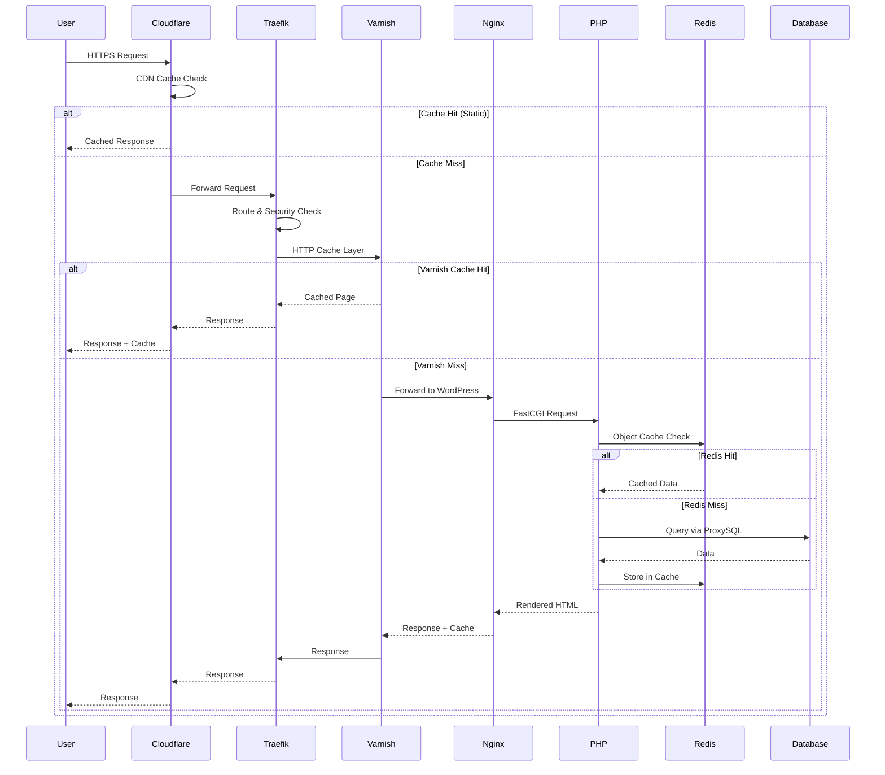
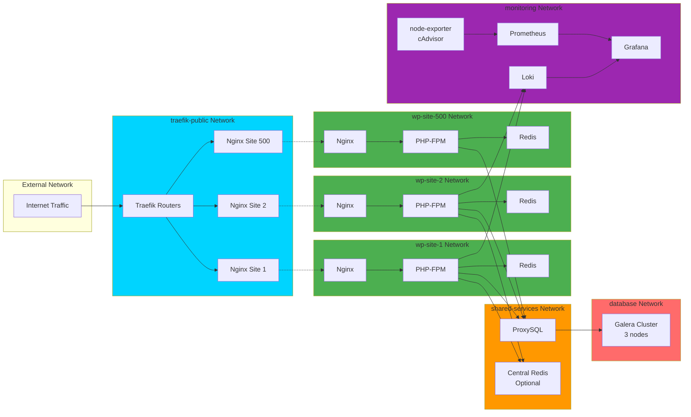
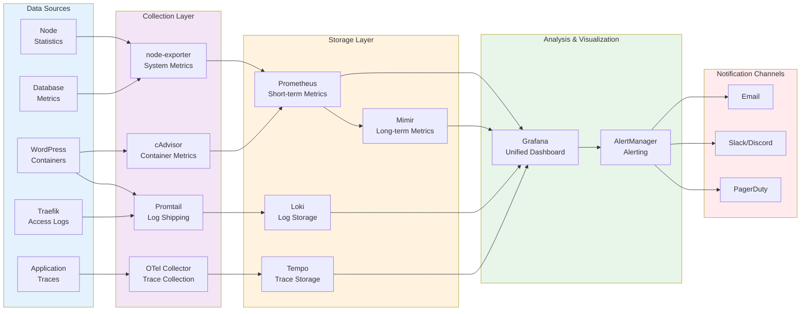
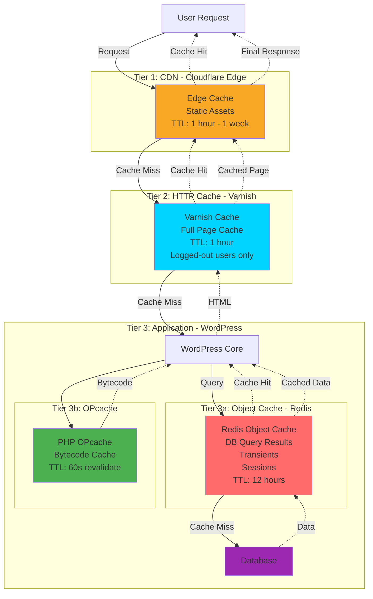
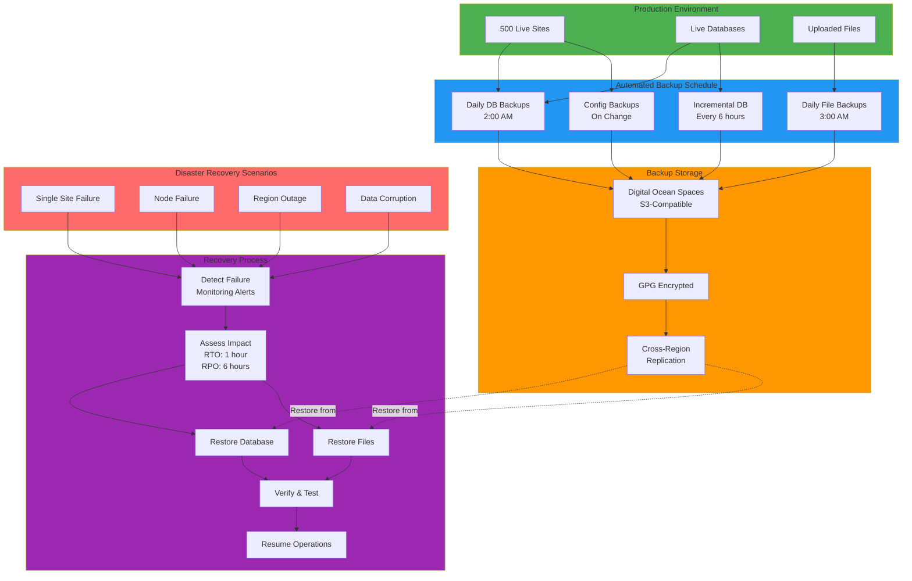
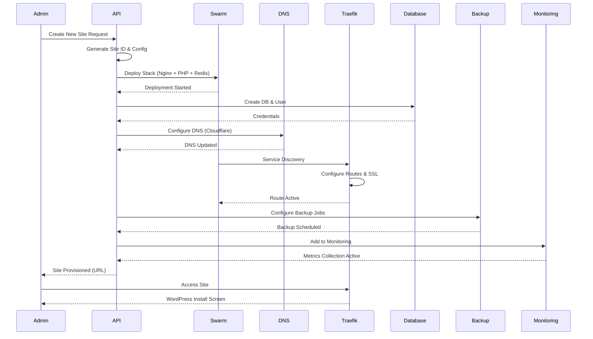

# WordPress Farm Network Architecture Diagram

## High-Level Infrastructure Topology

```mermaid
graph TB
    subgraph Internet["🌐 Internet"]
        Users[Users Worldwide]
    end
    
    subgraph Cloudflare["☁️ Cloudflare"]
        CF_DNS[DNS]
        CF_CDN[CDN Layer<br/>- Static Assets<br/>- Page Cache<br/>- DDoS Protection]
        CF_LB[Load Balancer<br/>Health Checks]
    end
    
    subgraph DO["Digital Ocean Infrastructure"]
        subgraph Edge["Edge Layer"]
            FIP[Floating IP<br/>High Availability]
            
            subgraph Traefik_Cluster["Traefik Cluster (3+ replicas)"]
                T1[Traefik Node 1<br/>+ CrowdSec + Varnish]
                T2[Traefik Node 2<br/>+ CrowdSec + Varnish]
                T3[Traefik Node 3<br/>+ CrowdSec + Varnish]
            end
        end
        
        subgraph Swarm["Docker Swarm Cluster"]
            subgraph Managers["Manager Nodes (3)"]
                M1[Manager 1<br/>16GB/8 vCPU]
                M2[Manager 2<br/>16GB/8 vCPU]
                M3[Manager 3<br/>16GB/8 vCPU]
            end
            
            subgraph Workers["Worker Nodes (20)"]
                W1[Worker 1-20<br/>~25 sites each]
                W2[WordPress Containers<br/>Nginx + PHP-FPM + Redis]
            end
            
            subgraph Database["Database Cluster"]
                DB1[MariaDB Galera 1<br/>16GB/8 vCPU]
                DB2[MariaDB Galera 2<br/>16GB/8 vCPU]
                DB3[MariaDB Galera 3<br/>16GB/8 vCPU]
                Proxy[ProxySQL<br/>Query Router]
            end
            
            subgraph Storage["Storage Layer"]
                GFS1[GlusterFS 1<br/>+ Block Storage]
                GFS2[GlusterFS 2<br/>+ Block Storage]
            end
            
            subgraph Caching["Central Cache (Optional)"]
                Redis_Cluster[Redis Cluster<br/>3 masters + 3 replicas]
            end
            
            subgraph Monitoring["Observability Stack"]
                Prometheus[Prometheus<br/>+ Mimir]
                Loki[Loki<br/>Log Aggregation]
                Tempo[Tempo<br/>Distributed Tracing]
                Grafana[Grafana<br/>Visualization]
            end
            
            subgraph Management["Management Layer"]
                Portainer[Portainer<br/>Container Management]
                Backup[Backup Services<br/>Restic + Percona]
            end
        end
        
        subgraph External_Storage["External Storage"]
            Spaces[DO Spaces<br/>S3-Compatible<br/>Encrypted Backups]
        end
    end
    
    Users --> CF_DNS
    CF_DNS --> CF_CDN
    CF_CDN --> CF_LB
    CF_LB --> FIP
    
    FIP --> T1
    FIP --> T2
    FIP --> T3
    
    T1 --> W1
    T2 --> W1
    T3 --> W1
    
    W1 --> W2
    W2 --> Proxy
    W2 --> Redis_Cluster
    W2 --> GFS1
    W2 --> GFS2
    
    Proxy --> DB1
    Proxy --> DB2
    Proxy --> DB3
    
    DB1 <-.->|Replication| DB2
    DB2 <-.->|Replication| DB3
    DB3 <-.->|Replication| DB1
    
    GFS1 <-.->|Sync| GFS2
    
    M1 <-.->|Raft| M2
    M2 <-.->|Raft| M3
    M3 <-.->|Raft| M1
    
    W1 --> Prometheus
    W2 --> Loki
    W2 --> Tempo
    
    Prometheus --> Grafana
    Loki --> Grafana
    Tempo --> Grafana
    
    Backup --> Spaces
    DB1 --> Backup
    GFS1 --> Backup
    
    Portainer -.->|Manage| W1
    Portainer -.->|Manage| M1

    style Users fill:#e1f5ff
    style CF_CDN fill:#f9a825
    style Traefik_Cluster fill:#00d4ff
    style Workers fill:#4caf50
    style Database fill:#ff6b6b
    style Storage fill:#9c27b0
    style Monitoring fill:#ff9800
    style Management fill:#2196f3
    style Spaces fill:#607d8b
```

## Detailed Network Flow

## Docker Swarm Network Architecture

## Security Layer Architecture

```mermaid
graph TB
    subgraph Internet["🌐 Internet Threats"]
        Attackers[Malicious Traffic<br/>DDoS, Bots, Scanners]
        Legitimate[Legitimate Users]
    end
    
    subgraph Layer1["Security Layer 1: Cloudflare"]
        CF_DDoS[DDoS Protection<br/>Automatic Mitigation]
        CF_WAF[Web Application Firewall<br/>OWASP Rules]
        CF_BotMgmt[Bot Management<br/>Challenge/Block]
        CF_RateLimit[Rate Limiting<br/>Per IP/Endpoint]
    end
    
    subgraph Layer2["Security Layer 2: Digital Ocean"]
        DO_FW[DO Firewall<br/>Port Restrictions<br/>IP Allowlists]
        DO_VPC[VPC Isolation<br/>Private Networking]
    end
    
    subgraph Layer3["Security Layer 3: CrowdSec"]
        CS_Agent[CrowdSec Agents<br/>on Traefik Nodes]
        CS_Bouncer[Traefik Bouncer<br/>IP Ban/Allow]
        CS_API[Local Security API<br/>Threat Intelligence]
        CS_Community[Community Blocklists<br/>Shared Intelligence]
    end
    
    subgraph Layer4["Security Layer 4: Traefik"]
        T_Middleware[Security Middleware<br/>- Headers<br/>- HSTS<br/>- CSP]
        T_RateLimit[Rate Limiting<br/>Per Service]
        T_CircuitBreaker[Circuit Breakers<br/>Prevent Cascade]
        T_Auth[Authentication<br/>BasicAuth/OAuth]
    end
    
    subgraph Layer5["Security Layer 5: Application"]
        WP_Hardening[WordPress Hardening<br/>- Disable XML-RPC<br/>- Limit Login<br/>- File Permissions]
        Network_Isolation[Network Isolation<br/>Per-Site Networks]
        Secrets[Secrets Management<br/>Docker Swarm Secrets]
    end
    
    subgraph Layer6["Security Layer 6: Infrastructure"]
        Encrypted_Overlay[Encrypted Networks<br/>--opt encrypted]
        Firewall_Rules[Host Firewalls<br/>iptables/nftables]
        SSH_Hardening[SSH Hardening<br/>Key-only, No Root]
    end
    
    Attackers --> CF_DDoS
    Legitimate --> CF_DDoS
    
    CF_DDoS --> CF_WAF
    CF_WAF --> CF_BotMgmt
    CF_BotMgmt --> CF_RateLimit
    
    CF_RateLimit --> DO_FW
    DO_FW --> DO_VPC
    
    DO_VPC --> CS_Agent
    CS_Agent <--> CS_API
    CS_API <--> CS_Community
    CS_Agent --> CS_Bouncer
    
    CS_Bouncer --> T_Middleware
    T_Middleware --> T_RateLimit
    T_RateLimit --> T_CircuitBreaker
    T_CircuitBreaker --> T_Auth
    
    T_Auth --> WP_Hardening
    WP_Hardening --> Network_Isolation
    Network_Isolation --> Secrets
    
    Secrets --> Encrypted_Overlay
    Encrypted_Overlay --> Firewall_Rules
    Firewall_Rules --> SSH_Hardening
    
    SSH_Hardening --> Applications[Protected Applications]

    style Layer1 fill:#f9a825
    style Layer2 fill:#00d4ff
    style Layer3 fill:#4caf50
    style Layer4 fill:#2196f3
    style Layer5 fill:#9c27b0
    style Layer6 fill:#ff6b6b
    style Applications fill:#4caf50
```

## Observability Data Flow

## Caching Architecture

## Disaster Recovery Flow

## Deployment Pipeline

```mermaid
graph LR
    subgraph Development["Development"]
        Dev[Developer]
        Git[Git Repository<br/>Feature Branch]
    end
    
    subgraph CI["CI/CD Pipeline"]
        Build[Build Images<br/>Docker Build]
        Test[Run Tests<br/>Unit + Integration]
        Scan[Security Scan<br/>Trivy]
        Push[Push to Registry<br/>Private Registry]
    end
    
    subgraph Staging["Staging Environment"]
        Stage_Deploy[Deploy to Staging<br/>docker stack deploy]
        Stage_Test[Automated Testing<br/>Smoke Tests]
    end
    
    subgraph Production["Production Deployment"]
        Prod_Deploy[Blue-Green Deploy<br/>Zero Downtime]
        Health_Check[Health Checks<br/>10s intervals]
        Rollback[Auto Rollback<br/>On Failure]
    end
    
    subgraph Monitoring["Post-Deploy Monitoring"]
        Monitor[Monitor Metrics<br/>Error Rates]
        Alert[Alert on Issues]
        Success[Deployment Success]
    end
    
    Dev --> Git
    Git -->|Push| Build
    Build --> Test
    Test --> Scan
    Scan -->|Pass| Push
    Scan -->|Fail| Dev
    
    Push --> Stage_Deploy
    Stage_Deploy --> Stage_Test
    Stage_Test -->|Pass| Prod_Deploy
    Stage_Test -->|Fail| Dev
    
    Prod_Deploy --> Health_Check
    Health_Check -->|Healthy| Monitor
    Health_Check -->|Unhealthy| Rollback
    Rollback --> Alert
    
    Monitor --> Success
    Monitor -->|Issues| Alert
    Alert -->|Critical| Rollback

    style Development fill:#e3f2fd
    style CI fill:#f3e5f5
    style Staging fill:#fff3e0
    style Production fill:#e8f5e9
    style Monitoring fill:#ffebee
```

## Site Provisioning Workflow

