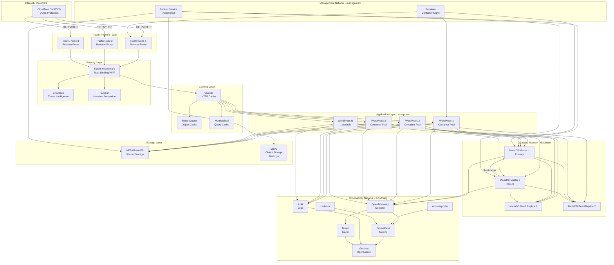

# Infrastructure Architecture - WordPress Farm

## Network Topology Diagram

## Architecture Layers

### 1. Edge Layer (Cloudflare)
- **DNS Management**: All domains point to Cloudflare
- **DDoS Protection**: Automatic mitigation
- **CDN**: Static asset caching
- **SSL/TLS**: End-to-end encryption
- **WAF**: Web Application Firewall rules

### 2. Reverse Proxy Layer (Traefik)
- **3+ Traefik Instances**: High availability
- **Automatic SSL**: Let's Encrypt integration
- **Load Balancing**: Round-robin across WordPress instances
- **Service Discovery**: Automatic container detection
- **Middleware Chain**: Security, caching, compression

### 3. Security Layer
- **Crowdsec**: Real-time threat detection and blocking
- **Fail2ban**: Pattern-based intrusion prevention
- **Traefik Middleware**: Rate limiting, IP filtering, headers
- **Network Isolation**: Docker networks for segmentation

### 4. Caching Layer (Multi-Tier)
- **Varnish (Layer 1)**: HTTP response caching
- **Redis (Layer 2)**: Object cache, sessions, transients
- **Memcached (Layer 3)**: Database query cache
- **WP Rocket (Layer 4)**: WordPress-specific optimizations

### 5. Application Layer (WordPress)
- **Containerized WordPress**: Custom images with optimizations
- **PHP-FPM**: Multiple pools for different site tiers
- **Horizontal Scaling**: Scale containers based on load
- **Health Checks**: Automatic container replacement

### 6. Database Layer
- **Primary/Replica Setup**: Master-Master replication
- **Read Replicas**: Distribute read load
- **Connection Pooling**: Optimize database connections
- **Backup Automation**: Continuous and scheduled backups

### 7. Storage Layer
- **NFS/GlusterFS**: Shared file storage for WordPress uploads
- **MinIO**: S3-compatible object storage for backups
- **Volume Replication**: Redundant storage across nodes

### 8. Observability Layer
- **Metrics**: Prometheus collects from all services
- **Logs**: Loki aggregates container and application logs
- **Traces**: Tempo stores distributed traces from OpenTelemetry
- **Dashboards**: Grafana visualizes all data sources
- **Alerts**: Prometheus Alertmanager for notifications

### 9. Management Layer
- **Portainer**: Web UI for container management
- **Backup Service**: Automated backup orchestration
- **Monitoring**: Health checks and automated recovery

## Network Segmentation

### Docker Networks

1. **web** (Traefik Network)
   - Traefik instances
   - Public-facing services
   - SSL termination

2. **wordpress** (Application Network)
   - WordPress containers
   - PHP-FPM instances
   - Isolated from direct internet access

3. **database** (Database Network)
   - MariaDB instances
   - Database replicas
   - Highly isolated, no public access

4. **caching** (Cache Network)
   - Redis cluster
   - Memcached instances
   - Varnish instances

5. **monitoring** (Observability Network)
   - Prometheus, Grafana, Loki, Tempo
   - OpenTelemetry collector
   - node-exporter, cadvisor

6. **management** (Management Network)
   - Portainer
   - Backup services
   - Administrative tools

## High Availability Strategy

### Traefik HA
- **3+ instances** across different nodes
- **Shared configuration** via Docker Swarm configs
- **Health checks** with automatic failover
- **Load balancer** (Digital Ocean Load Balancer) in front

### Database HA
- **Master-Master replication** for write availability
- **Read replicas** for read scaling
- **Automatic failover** via ProxySQL or MaxScale
- **Backup verification** and point-in-time recovery

### WordPress HA
- **Multiple replicas** per site tier
- **Stateless containers** (state in database/storage)
- **Health checks** and auto-restart
- **Graceful shutdown** handling

### Storage HA
- **NFS with replication** or GlusterFS distributed storage
- **Redundant storage nodes**
- **Automated backup** to object storage

## Scaling Strategy

### Horizontal Scaling
1. **Add nodes** to Docker Swarm cluster
2. **Scale WordPress containers** based on metrics
3. **Add database read replicas** for read-heavy workloads
4. **Scale Traefik instances** for increased traffic

### Vertical Scaling
1. **Upgrade node resources** (RAM/CPU)
2. **Optimize container limits** based on usage
3. **Database optimization** and query tuning

### Auto-Scaling Triggers
- CPU usage > 70% for 5 minutes
- Memory usage > 80% for 5 minutes
- Request latency > 500ms
- Queue depth > threshold

## Security Architecture

### Defense in Depth
1. **Cloudflare**: DDoS, WAF, rate limiting
2. **Traefik Middleware**: Additional rate limiting, IP filtering
3. **Crowdsec**: Behavioral analysis, threat intelligence
4. **Fail2ban**: Pattern-based blocking
5. **Network Isolation**: Docker networks prevent lateral movement
6. **Container Security**: Non-root users, minimal images
7. **Database Security**: Encrypted connections, limited access

### Security Zones
- **DMZ**: Traefik instances (public-facing)
- **Application Zone**: WordPress containers (isolated)
- **Data Zone**: Database (highly restricted)
- **Management Zone**: Admin tools (VPN-only access)

## Performance Optimization

### Caching Strategy
1. **Cloudflare CDN**: Static assets, images
2. **Varnish**: Full-page cache for anonymous users
3. **Redis**: Object cache, sessions
4. **Memcached**: Database query cache
5. **WP Rocket**: WordPress-specific optimizations
6. **OPcache**: PHP bytecode cache

### Database Optimization
- **Query optimization**: Indexes, query analysis
- **Connection pooling**: Reduce connection overhead
- **Read replicas**: Distribute read load
- **Partitioning**: Large table optimization
- **Caching**: Aggressive query result caching

## Disaster Recovery

### Backup Strategy
- **Database**: Hourly incremental, daily full backups
- **Files**: Daily snapshots of WordPress uploads
- **Configuration**: Version-controlled infrastructure as code
- **Off-site Storage**: MinIO with replication

### Recovery Procedures
- **RTO (Recovery Time Objective)**: < 1 hour
- **RPO (Recovery Point Objective)**: < 15 minutes
- **Automated Testing**: Weekly backup restoration tests
- **Documentation**: Step-by-step recovery procedures

## Resource Allocation (Per Node)

### Minimum Configuration (3 Nodes)
- **Node 1**: Traefik, WordPress (10 sites), Database Master
- **Node 2**: Traefik, WordPress (10 sites), Database Replica
- **Node 3**: Traefik, WordPress (10 sites), Observability Stack

### Recommended Configuration (5+ Nodes)
- **Nodes 1-2**: Traefik instances (2 per node)
- **Nodes 3-5**: WordPress containers (distributed)
- **Nodes 4-5**: Database cluster (Master + Replicas)
- **Node 6**: Observability stack
- **Node 7**: Management and backup services

### Scaling to 500+ Sites
- **10-15 nodes** for production workload
- **Dedicated database nodes** (3-4 nodes)
- **Dedicated cache nodes** (2-3 nodes)
- **Dedicated storage nodes** (2-3 nodes)
- **Load-based WordPress distribution**

## Monitoring & Alerting

### Key Metrics
- **Traffic**: Requests/sec, bandwidth
- **Performance**: Response time, error rate
- **Resources**: CPU, memory, disk I/O
- **Database**: Query time, connections, replication lag
- **Cache**: Hit rate, eviction rate
- **Security**: Blocked requests, threat detections

### Alert Thresholds
- **Critical**: Service down, database unavailable
- **Warning**: High latency, resource exhaustion
- **Info**: Scaling events, backup completions

## Cost Optimization

### Resource Efficiency
- **Right-sizing**: Match resources to actual usage
- **Spot instances**: Use for non-critical workloads
- **Reserved instances**: Commit to predictable workloads
- **Auto-scaling**: Scale down during low traffic

### Open Source Focus
- **No vendor lock-in**: All open-source tools
- **Self-hosted**: Control over costs and data
- **Community support**: Leverage open-source community

